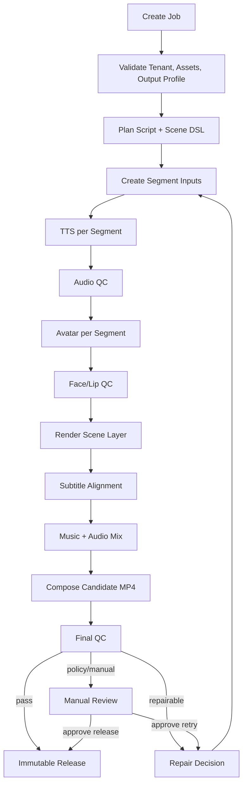

# Orchestration And GPU Workers

<!-- task: TASK-005 -->

## Purpose

This document defines how long-running video jobs should be orchestrated and how CPU/GPU/render workers should be separated. It is a contract-level design, not an implementation of Temporal, Kubernetes, queues, or workers.

## Orchestration Principles

- Use durable orchestration for long-running, retryable jobs.
- Split jobs into independently retryable segments.
- Keep stage attempts idempotent.
- Store manifests after every material output.
- Emit audit events for stage attempts, repair, review, and release.
- Keep GPU-heavy work behind adapter contracts.
- Avoid whole-job reruns when only one segment failed.

## Workflow Graph



## Worker Classes

| Worker Class | Stages | Hardware | Notes |
| --- | --- | --- | --- |
| Planner worker | planning, repair prompts | CPU | Calls LLM through controlled schema contract. |
| Validation worker | schema, asset, policy checks | CPU | No model inference. |
| TTS worker | TTS | GPU preferred, CPU fallback possible | Uses TTS adapter. |
| Avatar worker | talking-head generation | GPU required for high quality | Uses avatar adapter. |
| Render worker | HTML/Remotion scenes | CPU/GPU depending renderer | Must produce nonblank deterministic output. |
| Media worker | subtitle alignment, ffmpeg compose | CPU/GPU optional | Uses alignment/composer adapters. |
| QC worker | probes, ASR backcheck, face/lip checks | CPU/GPU mixed | Emits QC reports and repair recommendations. |
| Review worker | review queue and notifications | CPU | Human-in-loop orchestration. |

## Queue Ownership

Initial logical queues:

- `planning`
- `validation`
- `tts-gpu`
- `avatar-gpu`
- `render`
- `media`
- `qc`
- `review`
- `release`

Rules:

- Queue names are logical; implementation may map them to Temporal task queues or another backend.
- GPU queues must expose capacity and warmup status.
- Workers should reject jobs outside their tenant or capability scope.

## Stage Attempt Contract

Every attempt records:

- `attempt_id`
- `tenant_id`
- `job_id`
- `segment_id` when applicable
- `stage`
- `attempt_number`
- `idempotency_key`
- `queued_at`
- `started_at`
- `finished_at`
- `worker_class`
- `adapter_contract_version`
- `manifest_uri`
- `status`
- `failure_code`
- `audit_event_ids`

## Retry Policy

Default retry categories:

| Failure | Automatic Retry | Repair | Manual Review |
| --- | --- | --- | --- |
| transient runtime error | yes | no | after max retries |
| corrupt output | yes | maybe | after repeat |
| duration mismatch | yes | yes | after repeat |
| subtitle safe-area failure | no | yes | if repeat |
| face not detected | yes | yes | if repeat |
| lip sync below threshold | yes | yes | if repeat |
| missing consent | no | no | yes |
| revoked asset | no | no | yes/block |
| model license unverified | no | no | yes/block |

Suggested defaults:

- max automatic retries per stage: 2
- max repair loops per segment: 2
- manual review after repeated repair failure

## Timeout Policy

Initial planning values:

| Stage | Timeout |
| --- | --- |
| planning | 2 minutes |
| TTS segment | 5 minutes |
| avatar segment | 15 minutes |
| render segment | 5 minutes |
| alignment | 3 minutes |
| composition | 10 minutes |
| QC final | 10 minutes |

Open question:

- Actual values must be revised after benchmark data.

## Capacity Planning Assumptions

Track:

- average segment count per job
- average TTS seconds per generated second
- average avatar seconds per generated second
- render time per scene
- final composition time
- QC time per minute
- GPU warmup time
- queue wait time

Initial formula:

```text
job_latency = planning + max(segment_stage_latency_per_parallel_lane) + composition + final_qc + repair_overhead
```

Open questions:

- target concurrent jobs per tenant
- target quality tiers
- GPU class and count
- on-prem vs cloud elasticity

## Audit And Retention Hooks

Required audit events:

- `stage.started`
- `stage.completed`
- `stage.failed`
- `repair.requested`
- `repair.completed`
- `review.opened`
- `review.approved`
- `review.rejected`
- `release.created`
- `release.current_pointer_changed`

Retention hooks:

- mark superseded attempts
- mark failed attempts tied to incident/review
- preserve released traceability bundles
- honor tenant deletion policy once defined in final compliance

## Governance Checks

The orchestrator must check:

- selected voice/avatar assets are active before job start
- authorization snapshots exist before model stages
- authorization remains valid before release
- review blockers are cleared before publish-ready state
- signed artifact access is used for console retrieval

## Non-Implementation Boundary

This document does not:

- create Temporal workflows
- create queues
- create Kubernetes manifests
- start GPU workers
- download model weights

Those steps wait until contracts are accepted and implementation tasks are explicitly opened.

