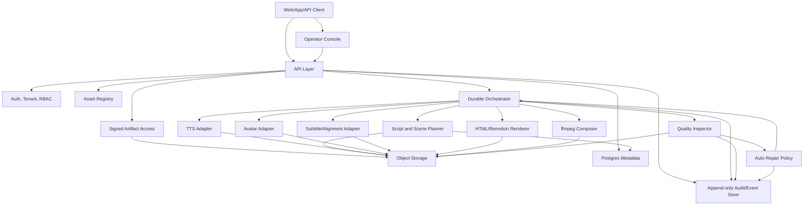

# Production Architecture

<!-- task: TASK-002 -->

## Purpose

This document locks the first production architecture for the enterprise talking-head video factory before model experiments, UI work, or runtime scaffolding begin.

The platform goal is a controlled production pipeline:

```text
text/article/opinion
  -> planning and scene DSL
  -> authorized voice/avatar assets
  -> segment TTS
  -> segment avatar/lip sync
  -> segment HTML animation render
  -> subtitles/music/composition
  -> quality gates and auto repair
  -> publish-ready vertical MP4
```

## Architecture Principles

- Treat every video as a job made of independently retryable segments.
- Keep LLM output constrained to validated scene DSL and repairable JSON.
- Treat voice and likeness cloning as authorized asset workflows.
- Isolate model services behind replaceable adapters.
- Store every material artifact and manifest before downstream stages consume it.
- Emit audit, quality, and traceability evidence as product artifacts.
- Prefer documentation and contracts before runtime scaffolding.

## Service Map



## Boundary Definitions

### API Layer

Responsibilities:

- Authenticate tenant users and operators.
- Create video jobs from text, article, or viewpoint input.
- Bind jobs to authorized voice, avatar, brand, and template assets.
- Expose job state, artifacts, QC results, review actions, and final downloads.
- Never call GPU models directly.

Out of scope:

- Running model inference.
- Making quality decisions without QC evidence.
- Bypassing asset authorization.

### Auth, Tenant, And RBAC

Responsibilities:

- Enforce tenant isolation on jobs, assets, artifacts, and audit logs.
- Separate user, operator, reviewer, and admin actions.
- Provide the authorization baseline that `TASK-008` will harden.

Open questions:

- Which identity provider should be supported first?
- Which roles are required for the first enterprise customer?

### Asset Registry

Responsibilities:

- Track voice profiles, avatar profiles, brand kits, music assets, templates, and consent evidence.
- Provide stable asset IDs used by the scene DSL and adapter manifests.
- Block unapproved or expired identity assets from generation.

Open questions:

- Whether voice and avatar profiles require periodic re-consent.
- Whether each final video needs visible AI labeling by default.

### Script And Scene Planner

Responsibilities:

- Convert input text into script segments and scene DSL.
- Validate DSL against schema.
- Repair invalid planner output with bounded retries.
- Produce segment metadata for orchestration.

Out of scope:

- Generating arbitrary HTML or executable code.
- Selecting unauthorized assets.

### Durable Orchestrator

Responsibilities:

- Own the job graph and stage transitions.
- Run segment-level tasks with idempotency keys.
- Retry or repair only failed stages where possible.
- Persist stage manifests before downstream consumption.

Assumption:

- Temporal or an equivalent durable workflow engine is preferred, but not selected until `TASK-005`.

### Model Service Adapters

Responsibilities:

- Expose stable contracts for TTS, avatar/lip sync, alignment, HTML rendering, and composition.
- Hide model-specific runtime details from API and product contracts.
- Return artifact manifests with model version, input hashes, output URIs, timing data, and failure codes.

Assumption:

- Candidate model stacks remain replaceable until benchmark and license review.

### Object Storage

Responsibilities:

- Store source inputs, normalized script, scene DSL, audio, video segments, subtitles, rendered scenes, composed outputs, QC reports, and audit bundles.
- Support retention and deletion policies set by governance.

Assumption:

- Use S3-compatible storage in production. MinIO is acceptable for local or private deployment.

### Metadata Store

Responsibilities:

- Store tenants, users, assets, jobs, segments, stage attempts, artifact pointers, QC state, and audit event pointers.
- Keep object storage as the source of large binary artifacts.
- Keep derived audit state only; the append-only Audit/Event Store is the authoritative event history.

Assumption:

- Postgres is the first metadata store unless a future deployment constraint invalidates it.

### Audit/Event Store

Responsibilities:

- Store append-only consent, authorization, stage attempt, QC, repair, review, release, and operator-action events.
- Provide event IDs that artifact manifests and traceability bundles can reference.
- Preserve tenant-scoped audit history even when derived metadata rows are repaired or reindexed.

Out of scope:

- Storing large media binaries.
- Replacing the metadata store for query-heavy job state.

### Quality Inspector

Responsibilities:

- Inspect every stage output with stage-specific pass/fail criteria.
- Emit QC reports and repair recommendations.
- Escalate repeated, unsafe, unauthorized, or ambiguous outputs to review.

Out of scope:

- Replacing human review for policy-sensitive failures.

### Operator Console

Responsibilities:

- Show job progress, stage failures, artifacts, QC reports, and audit evidence.
- Allow authorized retry, repair, review, reject, and release actions.
- Never hide quality or authorization failures behind a generic success state.
- Access metadata and artifacts only through authenticated API/RBAC paths or signed, tenant-scoped artifact URLs.

Out of scope:

- Direct database or object-storage reads that bypass tenant checks, authorization, audit logging, or signed access controls.

## Segment-Based Generation Flow

```text
1. Intake
   - Persist raw user input and job request.
   - Validate tenant, user, assets, and publish profile.

2. Planning
   - Produce script segments.
   - Produce scene DSL.
   - Validate and repair DSL.

3. Segment preparation
   - Create segment records.
   - Assign deterministic segment IDs and idempotency keys.
   - Store per-segment manifests.

4. Audio generation
   - Generate segment TTS using authorized voice profile.
   - Store wav and audio manifest.
   - Run audio QC and ASR backcheck.

5. Avatar generation
   - Generate segment talking-head video using authorized avatar profile.
   - Store raw avatar segment and manifest.
   - Run face/lip-sync QC.

6. Scene render
   - Render HTML/Remotion scene layer from validated DSL.
   - Store scene video or transparent overlay.
   - Run render QC.

7. Subtitle and music
   - Align subtitles to audio.
   - Mix background music with loudness normalization.
   - Store subtitle and audio-mix artifacts.

8. Composition
   - Compose avatar, scene layers, subtitles, music, and transitions.
   - Store candidate final MP4.

9. Final QC
   - Validate resolution, fps, codec, loudness, subtitles, black frames, face visibility, and traceability bundle.
   - Trigger repair/retry/manual review if needed.

10. Release
    - Mark final video publish-ready only when final QC and authorization checks pass.
```

## Job State Model

Initial state names for downstream refinement:

```text
created
validated
planning
planned
segmenting
generating_audio
generating_avatar
rendering_scenes
aligning_subtitles
composing
quality_checking
repairing
review_required
publish_ready
failed
cancelled
```

Rules:

- A job can be `publish_ready` only after final QC passes.
- A segment can fail without failing the entire job if repair remains possible.
- Repair attempts must reference the failed artifact and QC report that caused them.
- Manual review decisions must be audit events.

## Deployment Shape

```text
Control plane:
  API
  Orchestrator
  Metadata database
  Object storage
  Operator console
  Observability stack

Worker plane:
  CPU workers for planning, validation, subtitles, ffmpeg-light operations
  GPU workers for TTS when needed, avatar generation, heavy rendering, model QC
  Renderer workers for Remotion/HTML scenes
```

Assumptions:

- Production should support isolated GPU workers that can be scaled independently.
- CPU-only fallback modes may exist, but must be explicit quality downgrades.
- Network access to model weights and external APIs should not be required at generation time unless a customer explicitly enables it.

## Non-Functional Targets

Initial planning targets, subject to confirmation:

- Video format: vertical `1080x1920`, H.264/AAC MP4, 30 fps unless a platform requires otherwise.
- Duration: first product lane targets 30 to 90 seconds.
- Job latency: normal quality target 10 to 30 minutes after warmup.
- Reliability: job success target should be measured after fallback and repair, not only first-attempt model success.
- Tenancy: no cross-tenant asset, artifact, audit, or job access.
- Traceability: every final MP4 must point to source input, assets, model versions, QC reports, and operator actions.
- Observability: every stage emits structured logs, metrics, and trace IDs.

Open questions:

- Target concurrent jobs per tenant.
- Required latency SLO per quality tier.
- GPU budget and hardware class.
- Cloud, private cloud, or single-tenant on-prem deployment.
- First identity provider and enterprise SSO expectations.
- Required retention and deletion windows.

## Accepted Constraints For Downstream Tasks

- `TASK-008` must define the governance baseline before DSL, model, QC, and API contracts are finalized.
- `TASK-003` must reference authorized assets by stable IDs, not raw file paths.
- `TASK-004` must include tenant, asset, model version, input hash, output URI, and audit metadata in artifact manifests.
- `TASK-005` must preserve idempotency, partial retry, audit events, and retention hooks.
- `TASK-006` must treat unsafe or unauthorized outputs as review/escalation events.
- `TASK-007` must expose repair and review actions without bypassing consent or QC.
- `TASK-009` must reconcile the final traceability and compliance checklist after downstream contracts exist.
